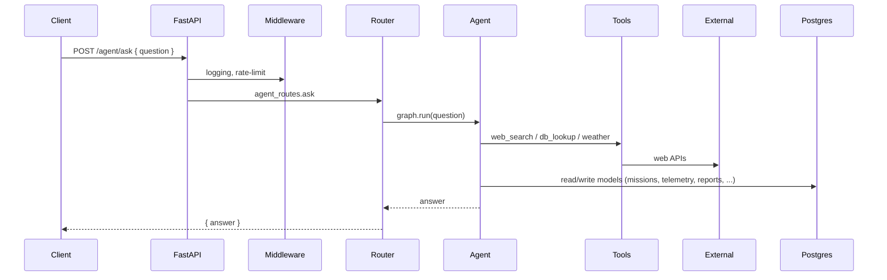

# Core Architecture

This document summarizes the backend's core architecture: the main components, data flow, storage model, and recommendations for deployment and operations.

## Overview

The system is an asynchronous HTTP service built with FastAPI. The application:

- Receives HTTP requests (for example `POST /agent/ask`).
- Uses middlewares for structured logging, rate limiting, and error handling.
- Initializes connections to Postgres (via SQLModel/Alembic) and Redis during application lifecycle (`init_db()`, `init_redis()`).
- Hosts an Agent (LangChain + Google Generative AI / Gemini) that orchestrates tool calls (web search, DB lookups, weather API, etc.).

## Key Components

- FastAPI application (`src/api/main.py`)
- Middlewares: logging, rate limiting, error handling (`src/api/middlewares/`)
- Routes: agent endpoints (`src/api/routes/agent_routes.py`)
- Agent & tools: `src/agent/agent.py` and `src/agent/tools/*`
- Data models: `src/models/*` (SQLModel — `User`, `Mission`, `IoTNode`, `Telemetry`, `FlightPath`, `CoverageResult`, `Report`, `ChatHistory`)
- Infrastructure: Postgres (persistent storage), Redis (ephemeral counters and caches)
- Migrations: Alembic (migrations/)

## Data Flow (high-level)



## Startup & Shutdown

- The FastAPI `lifespan` hook calls `init_db()` and `init_redis()` on startup and closes them on shutdown.
- Database connections should use connection pooling and reasonable timeouts for `asyncpg`.

## Data model — important notes

- `Telemetry` is a time-series, high-volume dataset — consider a dedicated TSDB or archival strategy if ingestion grows significantly.
- `FlightPath` and `CoverageResult` store path and coverage details as JSON, providing schema flexibility for evolving data.
- `BaseModel` includes a `deleted_at` field for soft deletes — ensure you have a retention/cleanup policy.
- Add indexes on common query fields and foreign keys (e.g. `mission_id`, `iot_node_id`, `telemetry.timestamp`, `iot_node.serial_number`).

## Agent & tools

- The Agent uses LangChain's agent patterns and integrates tools for web search, database queries, and weather APIs.
- The Agent depends on external API keys (Gemini, Tavily, etc.); configure them through environment variables and handle quotas/timeouts.
- `graph.run()` may return either a synchronous result or an awaitable — `agent_routes` handles both cases.

## Storage & migrations

- Use Postgres for primary data and Alembic for schema migrations (see `migrations/`).
- Redis is used for rate limiting and short-lived caches.

## Security & configuration

- Secrets (API keys, DB credentials, Redis password) must be stored outside the source tree (environment variables, secret manager).
- Tune rate-limiting thresholds based on production traffic patterns.
- Validate inputs with Pydantic and avoid leaking stack traces when `app_debug=False`.

Example environment variables to configure:

```env
GEMINI_API_KEY=
TAVILY_API_KEY=
POSTGRES_USER=
POSTGRES_PASSWORD=
POSTGRES_DB=
POSTGRES_HOST=
POSTGRES_PORT=
REDIS_HOST=
REDIS_PORT=
REDIS_PASSWORD=
APP_DEBUG=
```

## Observability & logging

- The application uses structured JSON logging (structlog) which is convenient for centralized logging systems.
- Add metrics (Prometheus) and tracing (OpenTelemetry) to monitor Agent performance and API latency.

## Scaling & deployment

- Run under an ASGI server (Uvicorn or Gunicorn with Uvicorn workers).
- Scale by running multiple application instances and sharing state via Postgres/Redis.
- If telemetry ingestion volume grows large, consider separating ingestion into a dedicated service.

## Recommended next steps

- Create Alembic migrations for the newly added models.
- Add health and readiness probes.
- Integrate metrics and distributed tracing.
- Add CI checks for migrations, linting, and unit tests.

---

This is a concise summary. If you'd like a deeper diagram (detailed sequence flows), a Kubernetes deployment layout, or example Kubernetes manifests, tell me which area to expand.
