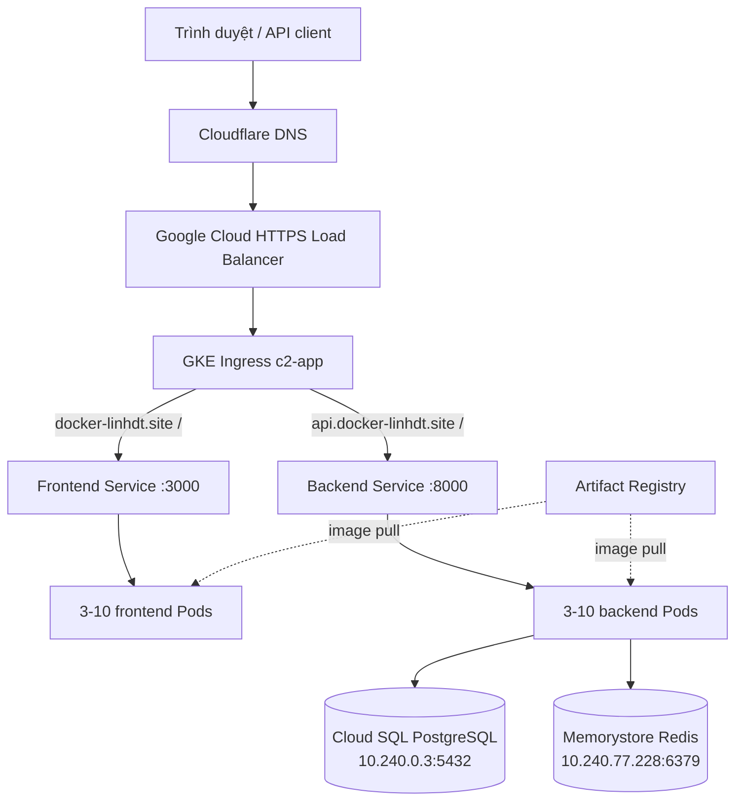

# Hướng dẫn kiến trúc và vận hành Kubernetes của C2 App

Tài liệu này giải thích toàn bộ phần Kubernetes đang có trong repository: ứng
dụng C2 App, GKE Ingress, bảo mật, autoscaling, migration, Jenkins chạy trên
GKE và luồng CI/CD. Nội dung bám theo cấu hình hiện tại, không phải một mẫu
Kubernetes chung.

## 1. Kubernetes chịu trách nhiệm gì trong hệ thống?

Terraform và Kubernetes có phạm vi khác nhau:

| Lớp | Công cụ | Tài nguyên chính |
| --- | --- | --- |
| Hạ tầng GCP | Terraform trong `infra/gke-data` | GKE, VPC/subnet, Cloud SQL, Memorystore, Artifact Registry, static IP, IAM và Workload Identity |
| Nền tảng ứng dụng | Manifest trong `k8s/app` | Namespace, Deployment, Service, Ingress, certificate, HPA, PDB, NetworkPolicy và migration Job |
| Jenkins | Helm và manifest trong `k8s/jenkins` | Jenkins controller, PVC, Ingress, agent ServiceAccount và quyền deploy |
| Pipeline | `Jenkinsfile` và `cloudbuild.yaml` | Test, build image, push image, migrate, sync prompt và rollout |

Kubernetes không chạy PostgreSQL hoặc Redis trong cluster. Backend kết nối qua
private IP tới Cloud SQL và Memorystore được Terraform tạo sẵn.

## 2. Kiến trúc tổng thể



Luồng request chính:

1. DNS của domain trỏ tới static global IP do Terraform cấp.
2. Google Cloud Load Balancer kết thúc kết nối TLS bằng Google-managed
   certificate.
3. GKE Ingress chọn Service dựa trên host và path.
4. Service chọn Pod bằng label.
5. Backend sử dụng private network để truy cập Cloud SQL và Redis.

## 3. Cấu trúc thư mục

```text
k8s/
├── README.md
├── KUBERNETES_GUIDE.md
├── app/
│   ├── namespace.yaml
│   ├── kustomization.yaml
│   ├── ingress.yaml
│   ├── network-policy.yaml
│   ├── backend/
│   │   ├── configmap.yaml
│   │   ├── secret.example.yaml
│   │   ├── deployment.yaml
│   │   ├── service.yaml
│   │   ├── autoscaling.yaml
│   │   └── migration-job.yaml
│   └── frontend/
│       ├── configmap.yaml
│       ├── deployment.yaml
│       ├── service.yaml
│       └── autoscaling.yaml
└── jenkins/
    ├── namespace.yaml
    ├── storage-class.yaml
    ├── gke-resources.yaml
    ├── deploy-rbac.yaml
    ├── values.yaml
    └── README.md
```

## 4. Namespace và Pod Security Standards

Ứng dụng chạy trong namespace `c2-app`, Jenkins chạy trong namespace
`jenkins`. Cả hai namespace đều bật Pod Security Standard ở mức `restricted`:

```yaml
pod-security.kubernetes.io/enforce: restricted
pod-security.kubernetes.io/audit: restricted
pod-security.kubernetes.io/warn: restricted
```

Ý nghĩa:

- `enforce`: Pod vi phạm sẽ không được tạo.
- `audit`: vi phạm được ghi vào audit log.
- `warn`: kubectl hiển thị warning cho cấu hình chưa đạt chuẩn.

Các workload vì vậy phải:

- chạy bằng UID/GID không phải root;
- không cho privilege escalation;
- drop toàn bộ Linux capabilities;
- dùng seccomp `RuntimeDefault`;
- tránh ghi vào root filesystem khi `readOnlyRootFilesystem` được bật.

Backend và frontend chạy với UID/GID `10001`. Docker image cũng phải có numeric
user tương ứng. Chỉ khai báo `USER appuser` mà không có UID số có thể làm
Kubernetes báo không xác minh được `runAsNonRoot`.

## 5. Kustomize và triển khai ứng dụng

`k8s/app/kustomization.yaml` gom các manifest thành một đơn vị deploy:

```bash
kubectl apply -k k8s/app
```

Kustomize thay placeholder image bằng repository và tag:

```yaml
images:
  - name: BACKEND_IMAGE
    newName: asia-southeast1-docker.pkg.dev/c2-app-501203/c2-app/backend
    newTag: v1
```

### Lưu ý về image drift

Jenkins deploy release bằng `kubectl set image`, ví dụ image tag
`42-a1b2c3d4e5f6`. Thao tác này thay đổi Deployment trực tiếp trong cluster
nhưng không sửa `kustomization.yaml`.

Vì vậy, chạy lại `kubectl apply -k k8s/app` sau một release có thể đưa image về
tag `v1`. Trước khi apply thủ công, phải kiểm tra:

```bash
kubectl -n c2-app get deployment backend frontend \
  -o custom-columns='NAME:.metadata.name,IMAGE:.spec.template.spec.containers[0].image'
```

Thiết kế hiện tại là CI/CD imperative, chưa phải GitOps hoàn chỉnh. Nếu muốn
Git là nguồn sự thật tuyệt đối, pipeline cần cập nhật image tag trong manifest
hoặc chuyển sang Argo CD/Flux.

## 6. Backend workload

### 6.1 Deployment

Backend Deployment có ba replica ban đầu và rolling update:

```yaml
replicas: 3
strategy:
  type: RollingUpdate
  rollingUpdate:
    maxUnavailable: 0
    maxSurge: 1
```

- `maxUnavailable: 0`: không chủ động làm giảm số Pod sẵn sàng trong rollout.
- `maxSurge: 1`: có thể tạo thêm tối đa một Pod trong lúc thay phiên bản.
- `revisionHistoryLimit: 3`: giữ ba ReplicaSet cũ để rollback.

Backend sử dụng ServiceAccount riêng nhưng tắt token mount:

```yaml
serviceAccountName: backend
automountServiceAccountToken: false
```

Ứng dụng không gọi Kubernetes API nên không cần token trong Pod. Đây là nguyên
tắc least privilege.

### 6.2 ConfigMap và Secret

`backend-config` chứa cấu hình không nhạy cảm: host, port, timeout, feature
flags, domain và tên model. `backend-secrets` chứa password và API key.

Pod nạp cả hai bằng `envFrom`:

```yaml
envFrom:
  - configMapRef:
      name: backend-config
  - secretRef:
      name: backend-secrets
```

Không commit `backend-secrets` thật. File `secret.example.yaml` chỉ là schema
tham khảo. Bootstrap thủ công:

```bash
kubectl -n c2-app create secret generic backend-secrets \
  --from-env-file=backend.production.env \
  --dry-run=client -o yaml | kubectl apply -f -
```

Đối với production lâu dài, nên đồng bộ secret từ Google Secret Manager bằng
External Secrets hoặc một secret operator được phê duyệt. Kubernetes Secret
chỉ encode base64, không tự mã hóa nội dung ở phía client.

### 6.3 Resource requests và limits

Backend request `250m` CPU và limit `1Gi` memory.

- Scheduler dùng `requests` để chọn node.
- HPA tính CPU utilization dựa trên CPU request.
- Vượt memory limit có thể khiến container bị `OOMKilled`.
- Backend hiện chưa có CPU limit, nên có thể burst khi node còn tài nguyên.

Các giá trị này là baseline, cần điều chỉnh bằng số liệu tải thực tế.

### 6.4 Health probes

Cả ba probe gọi `/api/health`:

- `startupProbe`: cho ứng dụng tối đa khoảng 120 giây để khởi động
  (`5 giây × 24 lần`). Trong thời gian này liveness chưa can thiệp.
- `readinessProbe`: quyết định Pod có được nhận traffic hay không.
- `livenessProbe`: restart container khi ứng dụng bị treo lâu dài.

Không nên dùng liveness probe để kiểm tra một dependency bên ngoài dễ gián đoạn.
Nếu `/api/health` fail chỉ vì Redis tạm thời lỗi, Kubernetes có thể tạo vòng
lặp restart không cần thiết.

### 6.5 Graceful shutdown

`preStop` sleep 10 giây để Load Balancer và endpoint controller có thời gian
ngừng chuyển request mới. BackendConfig đặt connection draining 30 giây. Hai
cơ chế này giảm request bị ngắt trong rollout hoặc scale down.

Root filesystem read-only; `/tmp` được cung cấp bằng `emptyDir` để ứng dụng có
vùng ghi tạm. Dữ liệu trong `emptyDir` mất khi Pod bị xoá.

## 7. Frontend workload

Frontend cũng có ba replica, rolling update không downtime, probes, PSS
restricted và root filesystem read-only.

Hai volume tạm được mount:

- `/tmp`: file tạm của runtime;
- `/app/.next/cache`: cache Next.js trong vòng đời Pod.

Cache này không được chia sẻ giữa các replica và mất khi Pod bị thay. Đây là
lựa chọn phù hợp vì frontend là workload stateless.

`NEXT_PUBLIC_API_URL` không nằm trong ConfigMap runtime. Biến `NEXT_PUBLIC_*`
được Next.js compile vào browser bundle, nên pipeline phải truyền nó khi build:

```bash
docker build \
  --build-arg NEXT_PUBLIC_API_URL=https://api.docker-linhdt.site/api \
  frontend
```

Thay ConfigMap sau khi build không thay đổi URL đã nằm trong JavaScript bundle.

## 8. Service, NEG và BackendConfig

Backend và frontend đều dùng `ClusterIP`. Chúng không trực tiếp mở public IP:

```yaml
type: ClusterIP
```

Service dùng selector để tìm Pod:

```text
Service backend
  selector app.kubernetes.io/name=backend
    -> backend Pod 1
    -> backend Pod 2
    -> backend Pod 3
```

Annotation NEG:

```yaml
cloud.google.com/neg: '{"ingress": true}'
```

NEG cho phép Google Load Balancer route trực tiếp tới Pod endpoint thay vì qua
NodePort. Backend Service còn tham chiếu `BackendConfig`:

- timeout request: 60 giây;
- connection draining: 30 giây;
- health check: HTTP `/api/health` trên port 8000.

Frontend hiện dùng health check do GKE suy ra từ cấu hình Service/Pod.

## 9. Ingress, DNS và TLS

Ingress dùng GKE external Ingress controller qua annotation:

```yaml
kubernetes.io/ingress.class: gce
```

Annotation này có thể hiện warning deprecated trong Kubernetes chung, nhưng GKE
Ingress controller này vẫn lựa chọn resource qua annotation; không nên tự đổi
sang `spec.ingressClassName` nếu chưa xác minh controller hỗ trợ.

Routing hiện tại:

| Host | Path | Service |
| --- | --- | --- |
| `api.docker-linhdt.site` | `/` | backend:8000 |
| `docker-linhdt.site` | `/` | frontend:3000 |
| Host/path không khớp | default backend | frontend:3000 |

Backend chỉ public qua host `api.docker-linhdt.site`. Request tới
`docker-linhdt.site/api` sẽ đi vào frontend như các path khác của domain gốc.

Ingress sử dụng static IP có tên `c2-app-ingress-ip`. Cả record `@` và `api`
có thể trỏ tới cùng IP vì Load Balancer phân biệt request bằng HTTP `Host`.

`ManagedCertificate` xin certificate cho cả hai domain. Điều kiện để certificate
thành `Active`:

1. DNS của mọi domain trỏ đúng static IP của Ingress.
2. Domain phải nhìn thấy được từ Internet.
3. Không có record A/AAAA cũ trỏ sang origin khác.
4. Trong lúc cấp certificate, nên để Cloudflare ở chế độ **DNS only**. Proxy
   Cloudflare có thể làm Google báo `FAILED_NOT_VISIBLE`.

Kiểm tra:

```bash
kubectl -n c2-app get ingress c2-app
kubectl -n c2-app describe managedcertificate c2-app-certificate
```

`kubernetes.io/ingress.allow-http: "false"` tắt HTTP frontend sau khi HTTPS
được cấu hình. Việc cấp certificate có thể mất hàng chục phút và đôi lúc lâu
hơn; trạng thái từng domain trong `describe` quan trọng hơn chỉ nhìn trạng thái
tổng quát.

## 10. NetworkPolicy

Policy đầu tiên deny toàn bộ inbound traffic tới tất cả Pod trong `c2-app`:

```yaml
podSelector: {}
policyTypes: ["Ingress"]
```

Policy thứ hai chỉ cho dải health checker/load balancer của Google truy cập
backend port 8000 và frontend port 3000:

- `35.191.0.0/16`
- `130.211.0.0/22`

NetworkPolicy có tính cộng dồn: default deny không ghi đè policy allow; traffic
được phép nếu khớp ít nhất một rule allow.

Các policy hiện chỉ kiểm soát ingress, chưa giới hạn egress. Backend vẫn có thể
kết nối Cloud SQL, Redis, DeepSeek, Tavily, LangSmith và AI log server.

Hiệu lực thực tế yêu cầu GKE Dataplane V2 hoặc Network Policy enforcement được
bật. Có manifest không đồng nghĩa CNI chắc chắn đang enforce.

## 11. High availability: HPA và PDB

### Backend HPA

- min: 3 replica;
- max: 10 replica;
- scale khi CPU trung bình vượt 70% request;
- scale khi memory trung bình vượt 80% request;
- chờ ổn định 60 giây khi scale up và 300 giây khi scale down.

### Frontend HPA

- min: 3 replica;
- max: 10 replica;
- target CPU: 70%;
- scale-down stabilization: 300 giây.

HPA cần resource requests. Nếu bỏ CPU request, CPU utilization target không có
mẫu số đáng tin cậy.

### PodDisruptionBudget

Cả backend và frontend đặt `minAvailable: 2`. Trong voluntary disruption như
drain node hoặc nâng cấp cluster, Kubernetes cố giữ ít nhất hai Pod sẵn sàng.

PDB không bảo vệ khỏi mọi sự cố: node crash, OOM hoặc application crash là
involuntary disruption. PDB cũng không thay thế replica count và multi-zone
node pool.

## 12. Database migration Job

Migration chạy bằng một Job riêng trước khi rollout backend:

```yaml
command: ["alembic", "upgrade", "head"]
```

Job dùng cùng backend image, ConfigMap và Secret với ứng dụng. Vì vậy image bắt
buộc chứa:

- `/app/alembic.ini`;
- `/app/migrations/`;
- dependencies Alembic;
- application source cần bởi `migrations/env.py`.

Nếu `.dockerignore` loại `alembic.ini` hoặc `migrations/`, Job báo:

```text
FAILED: No 'script_location' key found in configuration.
```

Migration Job không nằm trong `kustomization.yaml` vì Job template gần như
immutable. Pipeline tạo tên theo release:

```text
backend-migrate-<build-number>-<git-sha>
```

Tên riêng giúp lưu audit theo release và tránh sửa Job cũ. Job tự đủ điều kiện
dọn sau 24 giờ bằng `ttlSecondsAfterFinished: 86400`.

Nguyên tắc deploy database:

1. Build và push backend image mới.
2. Chạy migration bằng chính image đó.
3. Chờ Job thành công.
4. Chỉ sau đó rollout Deployment.

Migration production nên backward-compatible theo chiến lược expand/contract.
Ví dụ thêm column nullable trước, rollout code sử dụng nó, rồi mới xoá cấu trúc
cũ trong release sau. Điều này tránh Pod cũ và mới xung đột trong rolling update.

## 13. Jenkins trên GKE

### 13.1 Controller và agent

Jenkins controller được cài bằng official Helm chart `5.9.32`. Controller đặt:

```yaml
numExecutors: 0
executorMode: EXCLUSIVE
```

Controller chỉ điều phối; không build code. Mỗi build tạo một Kubernetes agent
Pod tạm với các container chuyên biệt:

- `backend-ci`: Python 3.12 và uv;
- `frontend-ci`: Node.js 22;
- `gcloud`: gửi build sang Google Cloud Build;
- `kubectl`: migration và rollout;
- `jnlp`: kết nối agent với controller qua WebSocket.

Agent Pod bị xoá sau build (`podRetention: Never`). Workspace dùng `emptyDir`,
do đó dependency/cache không tồn tại giữa các build. Đây là lý do lần cài pnpm
hoặc uv đầu tiên có thể chậm.

### 13.2 Vì sao Jenkins controller là StatefulSet?

Helm chart tạo controller dạng StatefulSet để có identity và persistent volume
ổn định. StorageClass và StatefulSet giải quyết hai vấn đề khác nhau:

- StatefulSet quản lý lifecycle/identity của Jenkins Pod.
- StorageClass mô tả cách GKE cấp Persistent Disk cho PVC.

Jenkins home được lưu trong PVC 50 GiB, dùng `jenkins-storage`:

- GKE PD CSI driver;
- balanced regional Persistent Disk;
- topology ở ba zone `asia-southeast1-a/b/c`;
- `WaitForFirstConsumer` để chọn topology khi Pod được schedule;
- `Retain` để không xoá disk khi PVC bị xoá;
- cho phép mở rộng volume.

`ReadWriteOnce` nghĩa volume chỉ được mount read-write bởi một node tại một thời
điểm. Vì controller chỉ có một replica nên phù hợp. StatefulSet không thay thế
StorageClass và StorageClass không thay thế StatefulSet.

### 13.3 Jenkins Ingress

Jenkins có domain `jenkins.docker-linhdt.site`, static IP riêng và
ManagedCertificate riêng. Health check gọi `/login` port 8080. Service vẫn là
ClusterIP và được gắn NEG.

`kubectl port-forward service/jenkins 8080:8080` chỉ cần khi:

- Ingress/certificate chưa sẵn sàng;
- cần truy cập khẩn cấp qua kubeconfig;
- đang debug nội bộ.

Khi Ingress hoạt động, người dùng không cần giữ port-forward.

### 13.4 Jenkins security

- Controller và agent chạy non-root.
- Không mount Docker socket.
- Controller có zero executor.
- Plugin được pin version để tránh update ngoài kiểm soát.
- Admin password lấy từ Secret `jenkins-admin`.
- Kubernetes RBAC của chart không được đọc Secret (`readSecrets: false`).
- Credentials như Git token và LangSmith key lưu trong Jenkins Credentials,
  không đặt trong `values.yaml`.

## 14. Workload Identity và RBAC

Jenkins agent có hai identity độc lập:

1. Kubernetes ServiceAccount `jenkins/jenkins-agent`.
2. Google Service Account
   `jenkins-agent@c2-app-501203.iam.gserviceaccount.com`.

Annotation sau nối hai identity bằng GKE Workload Identity:

```yaml
iam.gke.io/gcp-service-account: \
  jenkins-agent@c2-app-501203.iam.gserviceaccount.com
```

Nhờ đó agent gọi Cloud Build và Artifact Registry bằng short-lived identity,
không cần mount file service-account key JSON.

Trong Kubernetes, Role `jenkins-deployer` nằm ở namespace `c2-app`; RoleBinding
gán Role đó cho ServiceAccount từ namespace `jenkins`. Đây là quyền
namespace-scoped, không phải ClusterRole, nên agent không có quyền quản trị toàn
cluster.

Role hiện rộng hơn nhu cầu deploy image đơn thuần vì cho phép CRUD nhiều loại
resource. Pipeline hiện chỉ cần đọc Job/log, tạo Job, patch Deployment và theo
dõi rollout. Có thể harden thêm bằng cách giảm verbs/resources đúng với lệnh
pipeline thực sự dùng.

## 15. Luồng CI/CD

```mermaid
flowchart LR
    Git[Push / Pull Request]
    Scan[Jenkins multibranch scan]
    Diff[Phân loại file thay đổi]
    CI[Backend và frontend CI song song]
    Build[Google Cloud Build]
    Registry[Artifact Registry]
    Migrate[Alembic migration Job]
    Prompt[Sync LangSmith prompts]
    Deploy[kubectl set image]
    Rollout[Chờ rollout]

    Git --> Scan --> Diff --> CI
    CI -->|main + code changed| Build --> Registry
    Registry -->|migration changed| Migrate
    Migrate -->|prompt changed| Prompt
    Prompt --> Deploy --> Rollout
```



### 15.1 Change detection

Pipeline so sánh commit hiện tại với commit build trước và đặt cờ:

| Cờ | Điều kiện |
| --- | --- |
| `BACKEND_CHANGED` | file dưới `backend/` thay đổi |
| `FRONTEND_CHANGED` | file dưới `frontend/` thay đổi |
| `MIGRATIONS_CHANGED` | file dưới `backend/migrations/` thay đổi |
| `PROMPTS_CHANGED` | prompt defaults hoặc script sync thay đổi |

`FORCE_FULL_PIPELINE=true` bật tất cả cờ để test toàn bộ pipeline. Quyền deploy
production vẫn chỉ dành cho branch `main`.

### 15.2 CI

Backend chạy:

```bash
uv sync --frozen --extra dev
make check
```

Frontend chạy install, lint, format check và production build. Hai nhánh CI chạy
song song trong cùng agent Pod nhưng container khác nhau.

### 15.3 Build image

Jenkins không build Docker trực tiếp. Container `gcloud` gửi source tới Cloud
Build. Cloud Build tạo native Linux amd64 image và push vào Artifact Registry.

Tag image là immutable release identifier:

```text
<Jenkins build number>-<12 ký tự Git SHA>
```

Ví dụ: `8-cfae5f34b323`. Không dùng `latest`, vì `latest` không chỉ ra chính xác
source nào đang chạy và làm rollback/audit khó khăn.

### 15.4 Migration, prompt và deploy

- Migration chỉ chạy trên `main` khi migration thay đổi hoặc force full.
- Prompt sync chỉ chạy khi prompt liên quan thay đổi hoặc force full.
- LangSmith API key được inject bằng Jenkins credential ID
  `langsmith-api-key`.
- Deploy dùng `kubectl set image` riêng cho component thay đổi.
- Pipeline chờ `rollout status`; rollout lỗi làm build fail.

Prompt sync không nên gắn lại cùng một immutable commit tag ở mỗi lần push.
Tên prompt đã có prefix `production_`, runtime lấy commit `latest`, còn metadata
tags `agent`/`production` dùng để phân loại repository prompt.

## 16. Trình tự bootstrap từ đầu

### 16.1 Chuẩn bị kubeconfig

Cluster là regional, vì vậy dùng `--region`, không dùng `--zone`:

```bash
gcloud container clusters get-credentials devops-gke-demo \
  --region asia-southeast1 \
  --project c2-app-501203
```

### 16.2 Chuẩn bị ứng dụng

```bash
kubectl apply -f k8s/app/namespace.yaml
kubectl -n c2-app create secret generic backend-secrets \
  --from-env-file=backend.production.env
kubectl apply -k k8s/app
```

Sau đó chạy migration release-specific rồi kiểm tra rollout.

### 16.3 Chuẩn bị Jenkins

Theo thứ tự:

1. Apply namespace Jenkins.
2. Tạo Secret admin.
3. Apply StorageClass, certificate/health config và deploy RBAC.
4. Cài Helm chart bằng version đã pin.
5. Chờ StatefulSet và PVC ready.
6. Cấu hình DNS và chờ certificate Active.
7. Tạo multibranch pipeline và Jenkins Credentials cần thiết.

Chi tiết câu lệnh nằm trong `k8s/jenkins/README.md`.

## 17. Các lệnh vận hành thường dùng

### Tổng quan

```bash
kubectl -n c2-app get pods,svc,ingress,hpa,pdb
kubectl -n c2-app get events --sort-by=.lastTimestamp
kubectl -n c2-app top pods
```

### Logs và describe

```bash
kubectl -n c2-app logs deployment/backend --tail=200
kubectl -n c2-app logs deployment/frontend --tail=200
kubectl -n c2-app describe pod <pod-name>
kubectl -n c2-app describe ingress c2-app
```

### Rollout và rollback

```bash
kubectl -n c2-app rollout status deployment/backend --timeout=10m
kubectl -n c2-app rollout history deployment/backend
kubectl -n c2-app rollout undo deployment/backend
```

Rollback application không tự rollback database. Đây là lý do migration phải
backward-compatible.

### Kiểm tra endpoint nội bộ

```bash
kubectl -n c2-app port-forward service/backend 8000:8000
curl http://127.0.0.1:8000/api/health
```

### Seed lại demo database

Script `scripts/reset_and_seed_demo.sh` xoá dữ liệu trong schema `public`, giữ
`alembic_version`, rồi seed lại. Đây là thao tác phá huỷ dữ liệu và chỉ phù hợp
dev/demo:

```bash
./scripts/reset_and_seed_demo.sh
```

### Kết nối DBeaver tạm thời

Vì Cloud SQL dùng private IP, tạo một TCP tunnel Pod trong cluster rồi
port-forward về `localhost`. Không expose PostgreSQL bằng LoadBalancer Service.
Sau khi sử dụng phải dừng port-forward và xoá tunnel Pod.

## 18. Troubleshooting

| Triệu chứng | Nguyên nhân thường gặp | Cách kiểm tra/xử lý |
| --- | --- | --- |
| `get-credentials` báo cluster không tồn tại trong zone | Cluster là regional | Dùng `--region asia-southeast1` |
| `ImagePullBackOff` | Tag chưa được push, repository sai hoặc node thiếu quyền Artifact Registry | `kubectl describe pod`; kiểm tra chính xác image/tag trong Artifact Registry |
| `runAsNonRoot ... non-numeric user` | Docker image dùng username nhưng Kubernetes không xác minh UID | Tạo user có UID số trong Dockerfile và đặt `runAsUser` cùng UID |
| Pod `Running` nhưng không nhận traffic | Readiness probe fail hoặc Service selector sai | Kiểm tra endpoints, describe Pod và BackendConfig health |
| ManagedCertificate `Provisioning` lâu | DNS sai, Cloudflare proxy, record AAAA cũ hoặc Ingress chưa có IP | Kiểm tra từng `Domain Status`, DNS public và để DNS only |
| `FAILED_NOT_VISIBLE` | Google CA không nhìn thấy domain trỏ vào Load Balancer | Sửa A/AAAA, tắt proxy trong lúc cấp cert, chờ DNS propagate |
| Migration: `No script_location` | Image không chứa `alembic.ini`/`migrations` hoặc working directory sai | Kiểm tra `.dockerignore`, build image tag mới, không tái sử dụng image lỗi |
| Migration Job timeout | Pod crash/retry, DB không reachable, migration lock hoặc SQL lỗi | `kubectl describe job`; lấy log từng Pod của Job |
| `relation users does not exist` khi seed | Migration chưa chạy thành công | Chạy `alembic upgrade head` bằng migration Job trước khi seed |
| HPA hiện `<unknown>` | Thiếu metrics hoặc thiếu resource request | Kiểm tra Metrics Server/GKE metrics và Pod requests |
| Jenkins agent Pending | Image pull, thiếu node resource, PSS hoặc scheduling | Describe agent Pod trong namespace `jenkins` |
| Jenkins mất dữ liệu sau restart | PVC không mount hoặc persistence bị tắt | Kiểm tra StatefulSet, PVC, StorageClass và events |
| LangSmith `401/403` | API key sai hoặc không có quyền | Kiểm tra Jenkins credential và workspace/endpoint |
| LangSmith `409 Tag already exists` | Script cố tạo lại commit tag immutable | Không gửi lại `commit_tags`; dùng latest hoặc cơ chế promote tag riêng |
| Chạy `kubectl apply -k` làm image quay về `v1` | Manifest Git cũ hơn image do Jenkins set trực tiếp | Cập nhật tag trước khi apply hoặc áp dụng GitOps |

## 19. Những điểm đã đạt chuẩn production và phần cần nâng cấp

### Đã có

- workload stateless có nhiều replica;
- zero-downtime rolling update;
- startup/readiness/liveness probes;
- HPA và PDB;
- non-root, restricted PSS và read-only root filesystem;
- private Cloud SQL/Redis;
- HTTPS Load Balancer với static IP và managed certificate;
- image tag theo build/SHA;
- migration gate trước rollout;
- Jenkins controller không chạy build;
- ephemeral CI agents;
- Workload Identity thay cho service-account key;
- persistent regional disk cho Jenkins;
- namespace-scoped deploy RBAC.

### Nên cải thiện tiếp

1. Dùng External Secrets/Secret Manager thay cho Secret tạo thủ công.
2. Thu hẹp Role `jenkins-deployer` theo đúng verbs pipeline cần.
3. Chuyển image deployment sang GitOps để loại bỏ drift với `v1`.
4. Thêm policy egress có kiểm soát nếu yêu cầu bảo mật cao.
5. Thiết lập monitoring/alert cho rollout, HPA, 5xx, latency, saturation và
   certificate expiry.
6. Thực hiện load test để hiệu chỉnh requests, limits và HPA targets.
7. Thiết lập backup/restore có kiểm thử cho Jenkins PVC; source code trong Git
   không thay thế Jenkins credentials và job state.
8. Tách môi trường dev/staging/production bằng Kustomize overlays hoặc GitOps
   Application riêng thay vì sửa trực tiếp manifest base.
9. Thêm NetworkPolicy rõ ràng cho các luồng nội bộ nếu frontend/server-side cần
   gọi backend qua ClusterIP.
10. Đánh giá chiến lược database migration expand/contract trong mỗi release.

## 20. Mental model cần nhớ

- Deployment quản lý phiên bản và số lượng Pod.
- Service cung cấp địa chỉ ổn định và chọn Pod bằng label.
- Ingress đưa HTTP(S) từ bên ngoài tới Service.
- NEG nối Google Load Balancer trực tiếp tới Pod endpoint.
- ConfigMap chứa cấu hình thường; Secret chứa dữ liệu nhạy cảm.
- HPA thay đổi replica theo metrics; PDB bảo vệ availability khi disruption có
  chủ đích.
- StatefulSet tạo identity/lifecycle ổn định; StorageClass cấp volume. Hai khái
  niệm không thay thế nhau.
- Job chạy công việc hữu hạn như migration.
- RBAC kiểm soát Kubernetes API; Workload Identity kiểm soát Google Cloud API.
- CI xác minh source; CD build, migrate và rollout release đã xác minh.
- Kubernetes giúp vận hành workload, nhưng không tự giải quyết backup, quan sát,
  migration compatibility hoặc quản lý secret nếu chưa cấu hình các phần đó.
